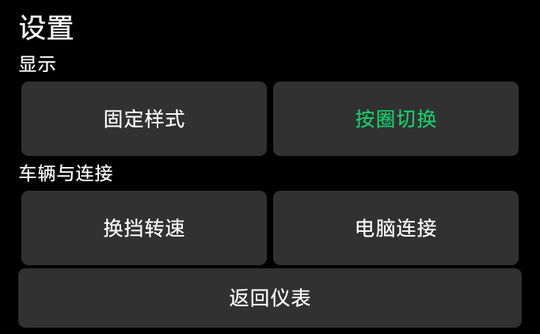
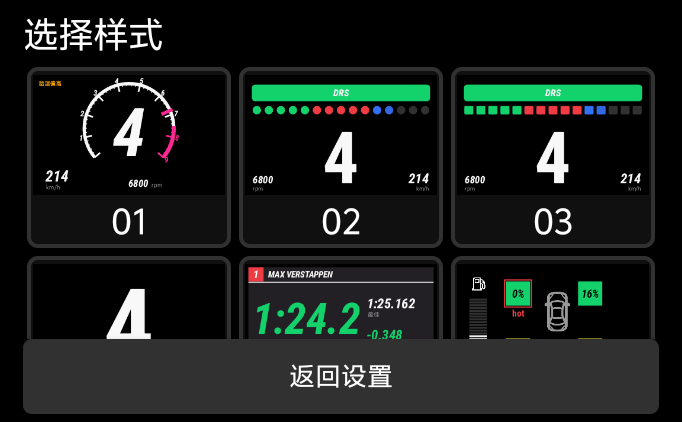
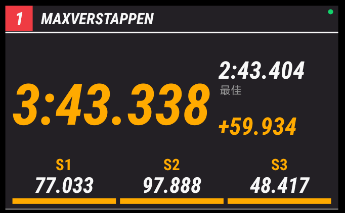
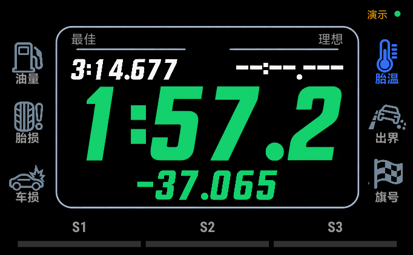

# AC 安卓赛车仪表 0.8.2

Android 8 及以上的原生赛车仪表，支持普通手机、平板与兼容的折叠屏副屏。横屏随屏幕尺寸缩放，X Flip 682 × 422 外屏为已验证的小屏适配场景。配合可见 Windows 终端连接监视器，读取经典版 Assetto Corsa 共享内存。其他厂商副屏能否启动第三方应用取决于系统限制，不保证每种副屏均可启动

[下载 v0.8.2](https://github.com/SturgeonIsSleepy/ac-android-dashboard/releases/tag/v0.8.2)　[宣传视频](https://github.com/SturgeonIsSleepy/ac-android-dashboard/releases/download/v0.8.1/AC-Android-Dashboard-Promo.mp4)

推荐下载完整安装包 `ACFlip-0.8.2.zip`，解压后包含安卓 APK、Windows 桥接、采集脚本、完整桥接源码和验证记录。当前使用调试签名，适合个人实机联调

## 使用

1. 双击 `dist/ACFlipBridge.exe` 打开电脑终端，显示地址、游戏状态、手机连接、心跳、RTT、收包与丢帧统计
2. 安卓设备安装 `dist/ac-flip-0.8.2.apk`，应用名称为“AC 外屏仪表”。普通手机直接打开，自动横屏；没有绑定 vivo 硬件或“超级小副屏”
3. 有线优先：打开手机 USB 调试并授权电脑，桥接自动建立 USB 通道。电脑需要 ADB，可从 [Android 官方 Platform-Tools](https://developer.android.com/tools/releases/platform-tools) 下载，将 `platform-tools` 文件夹放在桥接程序旁；也会寻找 PATH、ANDROID_HOME、ANDROID_SDK_ROOT 与默认 Android SDK。无线时手机与电脑连接同一局域网，填写电脑终端显示的 IPv4 地址。接上有线后自动切换，断开则重试无线。首次 USB 设置见 [Android 官方实机连接说明](https://developer.android.com/studio/run/device)
4. 进入游戏驾驶会话。X Flip 外屏可在“超级小副屏”桌面上滑，进入完整应用列表，点击“AC 外屏仪表”；普通安卓屏幕不需要该桌面工具
5. 音量上、下两键同时按住或长按仪表打开设置，点“固定样式”，通过编号缩略图选择。设置直接在当前屏幕打开，X Flip 外屏不要求展开。设置分为“显示”和“车辆与连接”。底栏已移除，选择保存后直接回到全屏仪表。启动时短暂显示快捷键提醒
6. 关闭电脑终端即停止连接，或按 `Q` / `Ctrl+C` 退出。程序不安装后台服务，不再默认隐藏运行

阶段自动切换：设置 → 按圈切换，点各圈按钮通过编号缩略图选择，再点右上“启用”。维修区显示进站信息；离开维修区后进入出场圈；下一次通过终点线后使用第 1 飞驰圈样式，之后依次切换。超过配置圈数沿用最后一套，再次进站后重新开始。可以增加或删除圈序，也可以选择固定样式。中途启动应用时无法还原未观测到的进站，当前圈从第 1 套开始

默认游戏目录为 `D:\Program Files\steam\steamapps\common\assettocorsa`。其他位置可运行 `ACFlipBridge.exe --game-dir "你的游戏目录"`

个人分段记录、全场分段记录与真实维修区限速需要 CSP Lua 采集应用。运行 `powershell -ExecutionPolicy Bypass -File .\Install-Relay.ps1`，其他游戏位置添加 `-GameDir "你的游戏目录"`。安装器只复制 ACFlip 自己的只读应用，并在 Lua 应用启用列表添加它，首次修改前保留备份。进入一次新的驾驶会话后加载，既有 CSP 保持原版本

换网络或电脑地址后，在设置中更新电脑 IPv4 地址

手机显示端使用 Android Canvas 原生绘制，无 WebView、无浏览器、无云服务器。手机应用只申请网络权限，保持前台显示时常亮；离开应用后停止接收

若 Windows 首次运行提示网络访问，请允许桥接程序在你的局域网内通信。使用 UDP 9876，单台手机遥测载荷约 57 KB/s。手机 VPN 若拦截局域网，需允许本地网络访问

## 四个页面

- 挡位与转速：中心大挡位、次要车速，环形刻度与指针加粗。仪表量程读取本地车辆的 RPM 仪表配置，红线默认使用游戏实际最高转速。设置的转速区显示“引擎最大转速”，下面滑块调整红线推荐换挡转速，按车辆保存。调整只影响提示，不能修改发动机限转。当前 Maserati 为 9000 量程、7500 限转。无法读取仪表配置时量程按游戏最高转速向上取整到整千
- 样式：所有显示集中在设置缩略图库，包含环形转速、F1 圆形灯、F1 分段灯、极简挡位、F1 计时、车况、弯道指引、飞驰圈、汽车计时仪表、参考图复刻十种固定样式，以及新增的阶段切换。缩略图由实际原生绘制生成。F1 样式从上到下为 DRS、转速灯和大挡位，车速在侧下方
- F1 DRS：距开启线 300 m 内，绿色从两边向中间平滑推进；游戏允许开启时填满，实际打开后逐渐变淡。距离读取当前赛道 `data/drs_zones.ini` 与游戏赛道进度，开启资格仍以游戏报告为准；未知距离不编造进度。无 DRS 车辆隐藏灯带
- 计时：扩大 AC F1 计时牌的使用面积，放大本圈、最佳圈、圈差，底部同时显示实际分段用时和加粗状态条。当前圈超过一分钟显示分秒格式；完圈成绩和全部分段一起停留 4 秒，随后同时切回新圈信息，清除旧圈分段。处理 AC 先归零计时、下一帧再更新圈数和分段索引的真实顺序，避免误重置。分段数直接来自赛道，最多四列、八段同时显示，更多分段跟随当前分段切换显示组
- 车况：分格燃油条与油泵图标，低油量整体转红。四轮为实色方块，随磨损率由绿、黄、橙转红；冷热边框和大号 `cold` / `hot`，不显示温度数值
- 指引：深色路书牌、鲜艳的等级轮廓、更粗的白色弯向箭头、距离和后续弯队列。支持 DRS 的车辆显示大号状态条，灰为未就绪、黄为可用、绿为开启；无 DRS 车辆隐藏。路线读取本地赛道的 `ai/fast_lane.ai`
- 飞驰圈：左上为下个弯和距离，右上理想圈速为个人各段最快用时之和，中间大圈速计时，底部燃油、四轮最大磨损和冷热状态。缺少任一分段记录时不编造理想圈速
- 汽车计时仪表：中央为本圈大计时、最佳圈、理想圈速和圈差，底部为可变分段条；两侧为油量、胎损、车损、胎温、驶离赛道和旗号灯。框架、数字字形和图标使用本次内置图像生成素材，图标增加简短标签辅助辨认。故障或警告发生时亮起，正常时暗色显示，只使用游戏实际提供的信息
- 参考图复刻：按用户提供的最终图片绘制黑底、蓝色轮廓、大白字、顶部计时与四轮磨损，下方赛道状况、路温、抓地力与燃油，保留图中英文标签。圈差变慢红色、变快绿色；胎温异常仍只显示 cold/hot。没有时速、转速、挡位、下一弯或制动力分配。手机全宽绘制，保持全屏微移
- 维修区：检测 `IsInPit` 或 `IsInPitLane` 自动覆盖当前样式，顶端真实维修区限速、大挡位、车速和油量；左侧当前轮胎配方及四轮磨损与 cold/hot，右侧实际路况、路温、抓地力和理想圈速。超速车速变红，限速或数据未知显示占位。固定样式离开维修区后恢复原显示，阶段模式离开后进入出场圈
- 出场圈：四个大胎温区突出 cold/hot 或正常绿色勾，独立赛道区显示干湿、路温与抓地力，保留油量，隐藏圈速。底部列出全部现有问题：冷胎、热胎、严重胎损、低油量、车损、出界、数据缺失及相关赛会警告。没有问题时两侧窄灯带缓慢闪绿，有问题时闪红。距终点最后 300 m 内，顶部加粗绿条按实际赛道长度与归一化位置从两端向中心平滑合拢，并显示剩余距离；缺少长度时不编造距离。通过终点线后从第 1 飞驰圈开始

设置的返回、恢复默认等文字按钮取消系统默认的内缩背景和最小高度，使用居中文字及明确内边距，返回与恢复默认高度为 40 dp，避免外屏短按钮裁掉文字

参考图的路温来自实际共享内存 RoadTemp；抓地力和湿滑数据来自 CSP。干湿分类是界面阈值：湿度低于 0.05 且积水低于 0.05 为 DRY，湿度在 0.05 到 0.7 为 DAMP，湿度至少 0.7 或积水至少 0.05 为 WET。数据缺失时占位。抓地力至少 0.97 为 High，至少 0.90 为 Med，其余 Low，条格展示实际比例。这些分级是显示规则，没有修改游戏物理

燃油圈数使用 AC 原生 fuelPerLap 估算向下取整，油耗关闭或估算未就绪时显示实际剩余升数。它是估算，不保证能够完成该圈数

完成分段没有严格刷新个人最快为黄色，等于记录也为黄色。单人刷新个人最快为紫色；多人刷新个人最快而没有刷新全场最快为绿色，刷新全场最快为紫色。全场记录未知时不冒充紫色。记录读取 CSP 的实际各段最快；中途连接缺少当前圈已完成分段时保持灰色，不补造分段成绩

磨损百分比反向读取游戏 `TyreWear` 健康信号，即 `100 - 原值`，0% 新胎、100% 磨尽。它是游戏信号损失指示，不是轮胎里程寿命预测。胎芯温度达到 110°C 显示 `hot`，低于 60°C 显示 `cold`，正常不标注，属于通用阈值。燃油低于 3 L 或油箱容量 5% 时提醒

弯级按 AI 路线几何曲率估算，1 紧、6 缓，0 级用 HP 表示发夹。它不是人工拉力路书，未推断坡度、路面或禁切弯等信息，尚未逐弯人工校准。箭头采用固定路径和与末段方向一致的实心箭头，左右镜像

## 防烧屏

背景为纯黑。整个仪表沿慢速曲线连续移动，横纵各不超过 1.5 个物理像素，周期约四分钟与五分十七秒，没有定时跳位；触摸坐标同步调整。暂停或断线且五分钟没有触摸后，用八秒渐变降低画面像素亮度，触摸或恢复实时遥测后快速恢复。正常驾驶不自动降低亮度

这些措施减少固定像素的持续曝光，不保证完全避免 OLED 烧屏。长时间不用时建议退出仪表或关闭外屏

每次屏幕刷新读取最新数据，超过 250 ms 没有新遥测即隐藏旧读数，连接失败自动重试。手机省去常驻品牌、RTT 和说明文字；右上圆点表示连接，双竖线表示暂停，回转箭头表示回放。仅演示发送端显示“演示”

## 现有方案与复用

检索了 [SIM Dashboard](https://www.stryder-it.de/simdashboard/)、[SimHub 手机显示方案](https://github.com/SHWotever/SimHub/wiki/Troubleshoot-Dashstudio-Web-access)和 [mdjarv/assettocorsasharedmemory](https://github.com/mdjarv/assettocorsasharedmemory)

最终采用 MIT 授权共享内存库的 `Physics`、`Graphics`、`StaticInfo` 数据结构，保留原始源码与许可，在此基础上增加约 60 Hz USB/TCP/UDP 桥接、原生外屏绘制和小屏交互。上游固定版本与说明见 `vendor/assettocorsasharedmemory/REVISION` 和 `docs/research.md`

只读车辆配置读取器移植自 [acd.py 1.0.0](https://github.com/philippkosarev/acd.py)，保留 GPL-2.0 许可，Windows 桥接的完整对应源码随安装包提供。车辆和赛道配置保持只读；CSP 采集应用仅在自己的目录输出比赛信息，不修改车辆或比赛规则

## 构建与验证

Windows 执行 `powershell -ExecutionPolicy Bypass -File .\build.ps1 -SdkRoot "D:\Android\Sdk"`，也可以设置 `ANDROID_HOME` 后省略该参数。构建前关闭正在运行的桥接程序，以免 Windows 锁定 EXE

构建使用 Android SDK 36、AGP 8.10.1、Gradle 8.11.1、JDK 21 和 Windows .NET Framework 编译器。Gradle 可从 PATH 或已有 8.11.1 缓存发现，也可通过 `-Gradle "你的 gradle.bat 路径"` 指定；`-GradleUserHome` 可指定缓存位置。只编译桥接可运行 `powershell -ExecutionPolicy Bypass -File .\bridge\build-bridge.ps1`。APK 当前为调试签名，签名密钥不随源码分发

`tests/probe_bridge.py` 采集真实遥测与发送频率，`tests/ProtocolCheck.java` 检查真实 C# 包与 Android 解码。`tests/LapTimingCheck.java` 检查可变分段、配色与完圈停留，`tests/RallyGuideCheck.cs` 检查方向、弯级、距离和路线闭合，`tests/BurnInCheck.java` 检查像素移位与空闲亮度状态。`tests/RacePhaseCheck.java` 检查维修区、出场圈、可变圈序及会话重置，`tests/phase_visual_check.py` 在真实外屏通过实际设置按钮和缩略图验证完整阶段切换。视觉测试工具位于 `tests/`，只用于开发联调，不随安装包启动

新版实机记录见 `docs/device-validation-0.8.2.md`，旧版历史记录保存在 `docs/`。本版仅验证经典版 AC，不宣称兼容 ACC、Evo 或 Rally。Android 8 为最低 API 兼容目标，其他品牌机型尚未逐机验证。最终参考图已由用户直接提供，复刻样式在原生外屏中实现

设备视觉脚本是开发联调工具，需要准备实际采集记录，并设置 `ADB`（或把 adb 加入 PATH）和 `ACFLIP_HOST`（电脑局域网 IPv4）。其中外屏 display ID 为本次 X Flip 的验证配置，其他设备需调整；纯 Java 计时和阶段检查不依赖设备

各组件许可见 [LICENSE.md](LICENSE.md)。研究用第三方工具缓存、原始游戏文件、用户配置、构建缓存和本机日志不随仓库分发

图像生成采用内置工具，最终素材在 `app/src/main/assets/hud08/`，提示词与修订记录在 `docs/imagegen-prompts-0.8.json`。数字、图标和框架从透明素材中读取，实时数据、中文标签、可变分段与弯道箭头仍由原生 Canvas 绘制。新素材也复用于车况、燃油和路况显示，保持原来的弯道方向与数据语义
